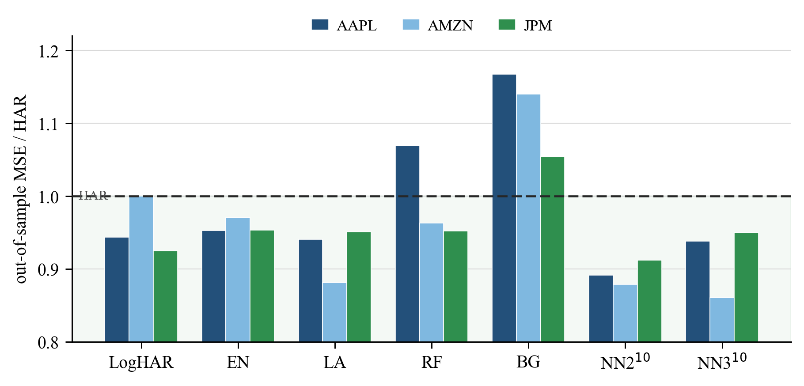
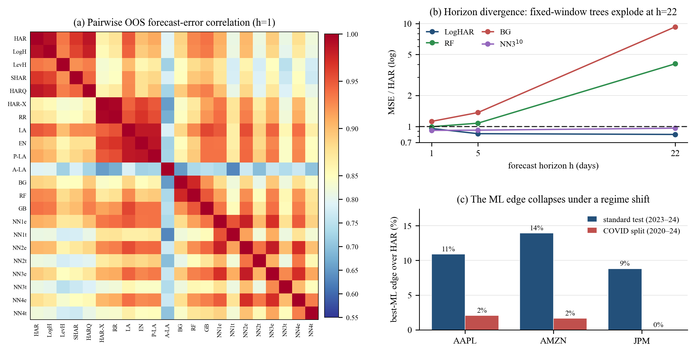

# Realised-variance forecasting: HAR vs machine learning


A replication and critical evaluation of Christensen, Siggaard & Veliyev (2023),
*A Machine Learning Approach to Volatility Forecasting* (Journal of Financial
Econometrics 21(5), 1680–1727). The paper asks whether off-the-shelf machine
learning beats the Heterogeneous Autoregressive (HAR) benchmark at forecasting
daily realised variance, and where any gain comes from. This repository
reproduces the methodology end to end in Python and tests it out of sample on
AAPL, AMZN and JPM over **2016–2024** — a window seven years later than the
original, spanning the COVID shock and the 2022 tightening.

AAPL and JPM are in the paper's Dow Jones cross-section; AMZN is not (it joined
the index only in 2020), so it serves as out-of-sample-stock evidence. The aim
is a methodologically faithful replication and an honest comparison, not exact
numerical reproduction — the data and sample period differ from the original.

## What it covers

Twenty-two forecasting models behind a single `Forecaster` interface:

- **HAR family** — HAR, LogHAR (with Jensen back-transform), LevHAR, SHAR, HARQ (with the insanity filter), and HAR-X.
- **Regularised regression** — ridge, lasso, elastic net, adaptive lasso, post-lasso.
- **Tree ensembles** — bagging, random forest, gradient boosting.
- **Neural networks** — four geometric-pyramid architectures, each as a single network and a 10-of-100 validation-ranked ensemble.

Two predictor sets (M_HAR: three RV lags; M_ALL: plus nine macro and firm-level
series), three horizons (1, 5, 22 days), and the paper's inference toolkit —
Diebold–Mariano tests with Newey–West HAC, the Hansen–Lunde–Nason Model
Confidence Set, and Accumulated Local Effects for variable importance. Realised
variance, signed semivariances and realised quarticity are constructed from
5-minute returns within each trading day. The critical path is covered by 37
unit tests.

## Headline result

At the one-day horizon on the wider feature set, the best model beats HAR by
9–14% per stock — neural-net ensembles lead, lasso close behind — which matches
the original's magnitude and ordering. On the three-lag set the gain nearly
disappears and only the NN ensembles beat HAR.



## What the replication shows

Where the data allow, it agrees with the paper: LogHAR is the strongest HAR
variant, NN ensembles are best at the daily horizon, and regularisation helps
once the extra predictors are added. The more interesting findings are where it
qualifies the original:

- The "machine learning" gain is mostly the **wider information set plus
  regularisation**; the nonlinearity-specific contribution is a minority of it
  (a regularised linear model captures roughly half).
- The edge is **loss-dependent**: under QLIKE — a noise-robust loss the paper
  does not report — it largely reverses, and HAR becomes hard to beat.
- It is **regime-dependent**: on a 2016–2019 / 2020–2024 split the edge
  collapses from 9–14% to 0–2%, with no model beating HAR on JPM.
- The paper's striking long-horizon tree result depends on **daily re-fitting**,
  not the tree class: fixed-window trees blow up at the monthly horizon, and
  rolling them daily roughly halves the gap.
- Statistically it is **thin**: the Model Confidence Set retains HAR in almost
  every cell, and almost nothing survives a multiple-testing correction at
  short horizons.



The three-page write-up is in [`REPORT.pdf`](REPORT.pdf); the full critique is in
[`CRITIQUE.md`](CRITIQUE.md) and the appendix in [`APPENDIX.pdf`](APPENDIX.pdf).

## Layout

```
src/
  data/         minute-bar cleaning, 5-min RV / RV± / RQ, realised kernel, macro features
  models/       HAR family, regularised, trees, neural networks, forecast combinations
  evaluation/   MSE/QLIKE, Diebold–Mariano, MCS, Mincer–Zarnowitz, ALE, bootstrap, VaR, regimes
  pipeline/     rolling/fixed-window harness and the orchestrator
  visualization/ figure and table builders
scripts/        numbered pipeline stages (preprocess → features → train → test → outputs) + extensions
tests/          unit tests for the critical path
outputs/        result tables (CSV), figures, and the methodology / results notes
config/         all hyperparameters, paths and switches
REPORT.pdf · CRITIQUE.md · APPENDIX.pdf
```

## Reproducing

Requires Python 3.11+. The minute-bar price data is not redistributed here (see
[`data/README.md`](data/README.md)); macro inputs are downloaded from public
sources by stage 2.

```bash
pip install -r requirements.txt
python -m pytest tests/ -q            # 37 passing
python scripts/00_run_full_pipeline.py
```

Individual stages (preprocess, build features, train each model family, run the
DM/MCS tests, compute ALE, generate outputs) can be run on their own; see the
docstring at the top of each script. Everything is driven from
`config/config.yaml`, and runs are seeded for reproducibility.

### Notable implementation choices

The neural networks run on scikit-learn's `MLPRegressor` (ReLU, with early
stopping standing in for dropout). Regularised and tree models are estimated
fixed-window for tractability, while HAR rolls daily; the consequences of that
choice — and every other departure from the paper — are documented in
[`outputs/LIMITATIONS.md`](outputs/LIMITATIONS.md) and
[`outputs/METHODOLOGY.md`](outputs/METHODOLOGY.md).

## Reference

> Christensen, K., Siggaard, M., and Veliyev, B. (2023). A Machine Learning
> Approach to Volatility Forecasting. *Journal of Financial Econometrics*,
> 21(5), 1680–1727. https://doi.org/10.1093/jjfinec/nbac020

## License

Code released under the MIT License (see [`LICENSE`](LICENSE)). The license
covers this code only — not the underlying paper or any price/macro data, which
are not redistributed.
